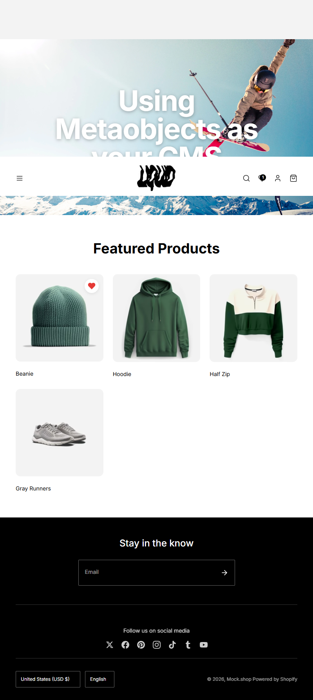
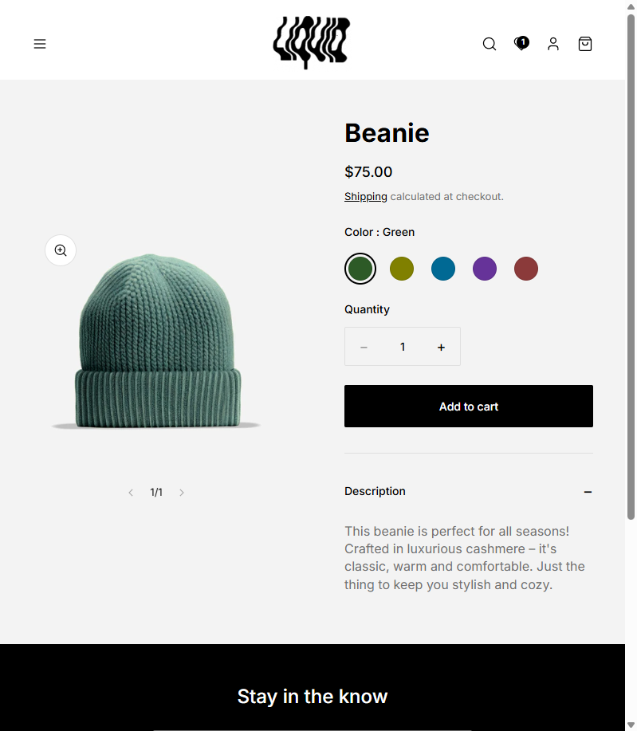
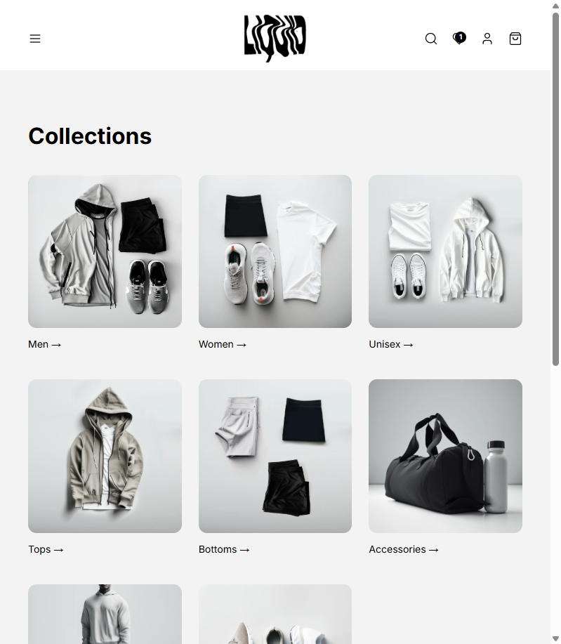

# Hydrogen + Vercel + Metaobjects CMS

A production-ready Shopify Hydrogen starter with a **free, open-source CMS layer** powered by Metaobjects. Deploy to Vercel in one click.

[](https://vercel.com/new/clone?repository-url=https://github.com/nathanmcmullendev/hydrogen-mockshop-clone&env=SESSION_SECRET,PUBLIC_STORE_DOMAIN&envDescription=Required%20environment%20variables&envLink=https://github.com/nathanmcmullendev/hydrogen-mockshop-clone%23environment-variables&project-name=hydrogen-store&repository-name=hydrogen-store)

**[Live Demo](https://hydrogen-vercel-fresh-self.vercel.app)** | **[CMS Documentation](./app/sections/README.md)**



---

## Why This Starter?

### The Problem

1. **Hydrogen + Vercel deployment is painful** - Documented developer frustration since 2022
2. **Premium Hydrogen templates cost $49-$299** - Just for basic CMS functionality
3. **Setting up metaobjects from scratch takes days** - Boilerplate code, GraphQL fragments, type definitions

### The Solution

This starter gives you:

| Feature | Value |
|---------|-------|
| **14 CMS Section Types** | Hero, Products, Testimonials, FAQ, Newsletter, and more |
| **Vercel-Optimized** | Zero-config deployment, works out of the box |
| **Works Without Shopify** | Uses `mock.shop` by default - try it instantly |
| **Static Fallback** | Beautiful homepage even without metaobjects configured |
| **Full TypeScript** | Complete type safety with generated Storefront API types |

**Free alternative to:**
- Ciseco ($49) - 15 section types
- Owen ($299) - Premium Hydrogen template
- Custom development (days of work)

---

## Features

### Quick View Modal

Preview products without leaving the page. Includes variant selection and add-to-cart.


### Product Pages

Full product experience with color swatches, quantity selector, image zoom, and expandable descriptions.



### Search with Filters

Real-time search with availability filters and multiple sort options.


### Collections

Clean collection grid with product counts and descriptions.



### Cart Drawer

Slide-out cart with full line item management, quantity controls, and discount codes.


### Additional Features

- **Wishlist** - localStorage-persisted, works across sessions
- **Customer Accounts** - Login, register, order history
- **Mobile-First** - Responsive design with hamburger menu
- **SEO Ready** - Meta tags, sitemap, robots.txt
- **Localization** - Multi-currency and language selectors

---

## Quick Start

### Try Without a Shopify Account

```bash
git clone https://github.com/nathanmcmullendev/hydrogen-mockshop-clone.git
cd hydrogen-mockshop-clone
npm install --legacy-peer-deps
npm run dev
```

Open http://localhost:3000 - uses `mock.shop` by default.

### Connect Your Shopify Store

1. Create `.env` from example:
   ```bash
   cp .env.example .env
   ```

2. Add your credentials:
   ```env
   SESSION_SECRET="your-secret-key-min-32-chars"
   PUBLIC_STORE_DOMAIN="your-store.myshopify.com"
   PUBLIC_STOREFRONT_API_TOKEN="your-storefront-token"
   ```

3. Run dev server:
   ```bash
   npm run dev
   ```

---

## Metaobjects CMS (14 Section Types)

Build pages visually in Shopify Admin using native Metaobjects - no external CMS required.

### How It Works

```
Without Metaobjects → Static homepage (works out of box)
With Metaobjects    → CMS-driven content (full control)
```

### Available Sections

| Category | Sections | Use Cases |
|----------|----------|-----------|
| **Hero** | Hero, Hero Slider | Landing pages, promotions |
| **Products** | Featured Products, Collection Grid | Homepage showcases |
| **Content** | Rich Text, Image+Text, Video | About pages, storytelling |
| **Social Proof** | Testimonials, Logos | Trust building |
| **Utility** | FAQ, Features, Banner, Countdown, Newsletter | Conversions |

### Setting Up CMS Mode

1. **Create metaobject definitions** in Shopify Admin → Content → Metaobjects
2. **Create a `route` metaobject** with handle `route-home`
3. **Add section references** to the route
4. **Homepage switches automatically** to CMS-driven content

Full setup guide: [app/sections/README.md](./app/sections/README.md)

---

## Deploy to Vercel

### One-Click Deploy

Click the button at the top. Set these environment variables:

| Variable | Value |
|----------|-------|
| `SESSION_SECRET` | Any string, min 32 characters |
| `PUBLIC_STORE_DOMAIN` | `mock.shop` or `your-store.myshopify.com` |

### CLI Deploy

```bash
npm i -g vercel
vercel
```

Add environment variables in Vercel Dashboard → Project Settings → Environment Variables.

---

## Project Structure

```
app/
├── components/        # Header, Footer, Cart, Search, Wishlist
├── routes/            # File-based routing (Remix convention)
├── sections/          # 14 CMS section types
│   ├── Sections.tsx   # Dynamic section router
│   ├── SectionHero.tsx
│   ├── SectionFeaturedProducts.tsx
│   └── ...
├── styles/            # Tailwind + custom CSS
└── utils/             # Metafield parser, helpers
```

---

## Environment Variables

| Variable | Required | Description |
|----------|----------|-------------|
| `SESSION_SECRET` | Yes | Session encryption (min 32 chars) |
| `PUBLIC_STORE_DOMAIN` | Yes | `mock.shop` or your Shopify domain |
| `PUBLIC_STOREFRONT_API_TOKEN` | For real stores | Storefront API public token |
| `PRIVATE_STOREFRONT_API_TOKEN` | Optional | Storefront API private token |

---

## Tech Stack

- [Hydrogen](https://hydrogen.shopify.dev/) - Shopify's React framework
- [Remix](https://remix.run/) - Full-stack web framework
- [TypeScript](https://www.typescriptlang.org/) - Type safety
- [Tailwind CSS](https://tailwindcss.com/) - Utility-first styling
- [Vercel](https://vercel.com/) - Edge deployment

---

## Development

```bash
npm run dev          # Start dev server
npm run build        # Production build
npm run typecheck    # Type checking
npm run lint         # ESLint
```

---

## Comparison

| Feature | This Starter | Ciseco ($49) | Blueprint (Free) |
|---------|--------------|--------------|------------------|
| **CMS Section Types** | 14 | 15 | Basic |
| **Metaobjects CMS** | Yes | Yes | Yes |
| **Vercel Deploy** | One-click | Manual | One-click |
| **Works Without Shopify** | Yes (mock.shop) | No | No |
| **Static Fallback** | Yes | No | No |
| **Quick View** | Yes | Yes | No |
| **Wishlist** | Yes | Yes | No |
| **TypeScript** | Full | Full | Partial |
| **Open Source** | Yes | No | Yes |

---

## Contributing

PRs welcome. Please run before submitting:

```bash
npm run build
npm run typecheck
npm run lint
```

---

## License

MIT - Use freely for personal or commercial projects.

---

**Built for developers who want premium Hydrogen features without premium prices.**
